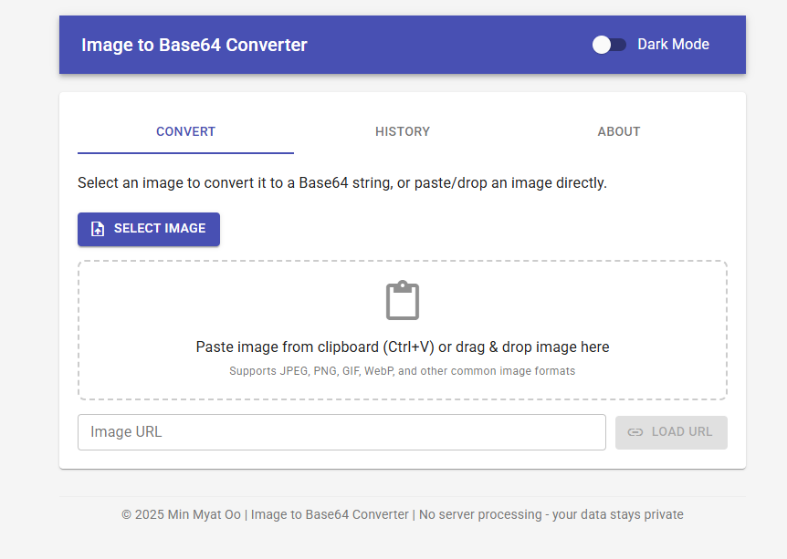

# Image to Base64 Converter

A lightweight, browser-based tool to convert images to Base64 encoded strings. This application runs entirely in your browser with no server-side processing, ensuring your data remains private.

## Features

- **Multiple Input Methods**: Upload, paste (Ctrl+V), drag & drop, or load from URL
- **Image Processing**: Convert between formats (JPEG, PNG, WebP), adjust quality, resize dimensions
- **Output Options**: Copy to clipboard, download as text, show with/without MIME prefix
- **Image Manipulation**: Compress images, copy image to clipboard, download processed images
- **History Tracking**: Automatically saves your last 10 conversions for easy reuse
- **Dark Mode**: Toggle between light and dark themes for comfortable viewing

## Usage

Simply open `index.html` in any modern web browser - no installation required!

1. Add an image using one of the available methods:

   - Click "Select Image" to upload
   - Paste an image from clipboard (Ctrl+V)
   - Drag and drop an image file
   - Enter an image URL and click "Load URL"

2. Use the settings to customize your output:

   - Change format, quality, or dimensions
   - Use "Aggressive Compression" for significantly smaller files

3. Copy or download the resulting Base64 string

## Technical Details

- Built with React and Material UI (loaded via CDN)
- Pure frontend implementation (single HTML file)
- Supports all major image formats
- Uses browser localStorage to preserve settings and history
- Fully responsive design for mobile and desktop

## Creator

Created by Min Myat Oo

---

© 2025 Min Myat Oo | No server processing - your data stays private
